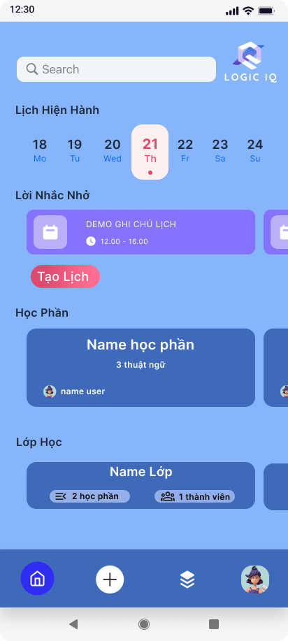

# 🧠 QLogicIQ - Ứng dụng luyện tư duy logic và kiến thức tổng hợp

**QLogicIQ** là một ứng dụng học tập dạng quiz, kết hợp giữa rèn luyện trí tuệ và giải trí. Dành cho sinh viên muốn nâng cao kỹ năng logic, IQ và kiến thức tổng quát thông qua các câu hỏi tương tác sinh động.

---

## 🚀 Tính năng chính
Đăng ký / Đăng nhập người dùng
Làm quiz theo chủ đề: Logic, Toán học, IQ, Kiến thức tổng hợp
Xem điểm số và kết quả ngay sau khi làm bài
Trang cá nhân
Giao diện đẹp

---

## 🎨 Giao diện (UI Design)

> Toàn bộ thiết kế Figma được lưu tại:  
[📁 Link Figma (đã export ra ảnh PNG)](https://www.figma.com/design/MipRDKmAcKVj9R8r4PZGUq/QUIZ-LOGIC-IQ?node-id=0-1&t=SB9C7NPlq9hGUFRu-1)

| Màn hình | Xem trước |
|----------|-----------|
| Login/Register |  |
| Trang chủ |  |
| Danh sách Quiz |  |
| Làm bài Quiz |  |
| Kết quả |  |

---

## 🔧 Công nghệ sử dụng

- 💻 Frontend: Kotlin
- 🔙 Backend: Node.js + Express
- 🎨 Thiết kế UI: Figma

